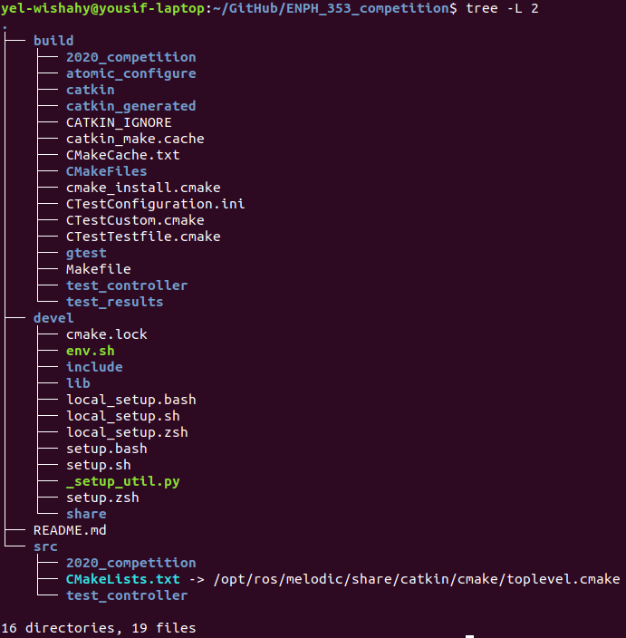

# ENPH_353_competition - time_trials
ENPH 353 ML Project 

**Repo:**  time_trials
**Description:** This repo contains a ros package that test controller for time trials that controls the robot in the enph-353 gazebo environment. 

**Author(s):** Yousif El-Wishahy

## Table of Contents
1. [Setting up repo and workspace](#setup)
2. [Launch Gazebo Sim](#launch)
3. [Gazebo / Robot Settings](#settings)
4. [Controller Settings](#controller_settings)
5. [Debug View](#debug_view)

## Collab Notebook

[Computer Vision Test Notebook](https://colab.research.google.com/drive/1eKr42IbJgtu4PkAXP4f3kEiInMTaQDVN?usp=sharing)

<br />

# Setting up repo and ros ws <a name="setup"></a>

**You can just clone this repo as it contains the latest competition package**

Info for setting up and launching the competion can be found in the competion notes doc : [Competition Notes](https://docs.google.com/document/d/1FNGecS2-8v_lKdlxzUxki_ZMZeK3RGqgdYo-JMTh0OQ/edit) 

What to do when cloning this repo:
1. Clone this repo
2. cd to repo
3. Run `catkin_make clean` or delete the *devel* and *build* folders
4. Run `catkin_make`


Your file tree should look like this:



<br />

# Launching Controller and Debug Nodes <a name="launch"></a>

There is a launch file called `test_controller.launch` in the package that launches all the required nodes! If you only want to run the main controller you can scipt to the [Launching Nodes Individually](#launching_individually") section.

## Important: Before Lauching the Node/Launchfile

1. Setup workspace with catkin_make and source competition setup.bash file 
    * If you follow the doc it should be `source ~/ENPH_353_competition/devel/setup.bash`
2. Launch competition world 
    * `cd ~/ENPH_353_competition/src/2020_competition/enph353/enph353_utils/scripts`
    * `./run_sim.sh -vpg`
3. Launch score tracker in the same directory with `./score_tracker.py`

## Launch with launch file

Command: `roslaunch test_controller test_controller.launch`

## Launching Nodes Individually <a name="launching_individually"></a>

* Command:   `rosrun test_controller robot_driver.py`
* Command:   `rosrun test_controller debug_show.py`

<br />

# Gazebo Settings <a name="settings"></a>

<br />

## Changing realtime factor / simulation speed

The defualt simulation speed is ~2.5 realtime factor, to control realtime factor we change `real_time_update_rate`. The robot is much more stable at slower sim speeds!

* we can change this in the simulation menu on the fly
* or we can also change it in a settings file so that it starts up with those settings every time

In the file at `/2020_competition/enph353/enph353_gazebo/worlds/353.world` go to the bottom and find the following segment: 

```
    <physics type='ode'>
      <max_step_size>0.001</max_step_size>
      <real_time_factor>10.0</real_time_factor>
      <real_time_update_rate>1000.0</real_time_update_rate>
    </physics> 
```

**change the number in `<real_time_update_rate>1000.0</real_time_update_rate>` from `10000.0` to `1000.0`.**

<br />

## Changing Robot Start Location and Resetting Location

For some testing cases , I found it useful to start the robot off in a specific position istead of manually having to move it every time. This is useful especially since our controller is in the early stages of development and doesn't work well in some areas of the world simulation.

**we can reset robot position to default in gazebo with:** `Ctrl+Shift+R` (this resets all models to start locations)

To change the start position of the robot, we need to modify a launch file.

Go to the file at `/2020_competition/enph353/enph353_utils/launch/robots.launch`

In this file you'll find the section:
```
	<group ns="R1">
		<param name="tf_prefix" value="R1_tf" />
		<include file="$(find adeept_awr_gazebo)/launch/adeept_awr_urdf.launch">
			<arg name="init_pose" value="-x 0.0 -y -0.85 -z 1.0 -R 0.0 -P 0.0 -Y 4.71" />
			<arg name="robot_name"  value="R1" />
		</include>
		<include file="$(find enph353_utils)/launch/desktop.launch"/>
	</group>
```

**We want to change the values in `<arg name="init_pose" value="-x 0.0 -y -0.85 -z 1.0 -R 0.0 -P 0.0 -Y 4.71" />` which are the 6 DOF of the robot.**

*Some useful start locations:*

* `"-x 0.03 -y -1.2 -z 0.1 -R 0.0 -P 0.0 -Y -0.12"` (is a stable start for the current controller because it is away from the intersections/parking blocks)


<br />

# robot_driver.py <a name="controller_settings"></a>
If `DEBUG=True` at the top of the file, more error messages and labelled camera feed will be published.

# debug_show.py <a name="debug_view"></a>
This ros node subscribes to main controller debug topics to receive pid error values and labelled camera feed. This is a seperate node to ensure the pid control loop can run as fast as possible (in a seperate thread) without needing to do 'wasteful' side tasks like showing debug info/error values. 
